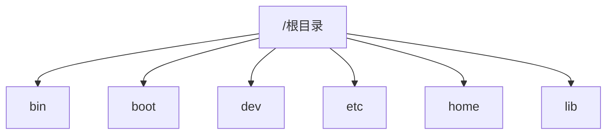

# 20190920

## 复习
* 当今的三大操作系统种类是 <u>_服务器端_ 、 _移动终端_、 _PC端</u>。
* Linux是一种 <u>_多用户_、 _多任务_</u> 操作系统，它最大特色是属于 _自由软件_ 
* Linux系统由 <u>_应用_、 _shell_、 _内核</u>组成_
* Linux核心版本r.x.y
r：主版本
x：奇数表示开发中的版本
        偶数表示稳定版本
y：错误修补次数
* 何谓多用户(Multi-user) 多任务(Multi-task)？
多用户：多人同时使用同一机器

## 新内容
ext是Linux的默认文件系统

|IDE硬盘 | PC | /dev/hd[a-c]|
| :-----| ----: | :----: |
|**SCSI硬盘** | **服务器** | **/dev/sd[a-z]** |

主分区最多4个 拓展分区再分逻辑分区

1.pwd当前路径命令

> $ pwd

2.date日期命令

> $ date 

3.who在线用户命令

> $ who

4.cal日历命令

> $ cal

5.uname
-r:显示发行版本号
-m:显示所用机器类型
-i:显示所需硬件平台
-v:显示操作系统版本

> $ uname -

6.wc统计命令
wc命令用来统计给定文件的行数、字数和字符数
l为统计行数，w为统计字数，c为统计字节数

> $ wc file1

7.su切换用户命令

> \# su

